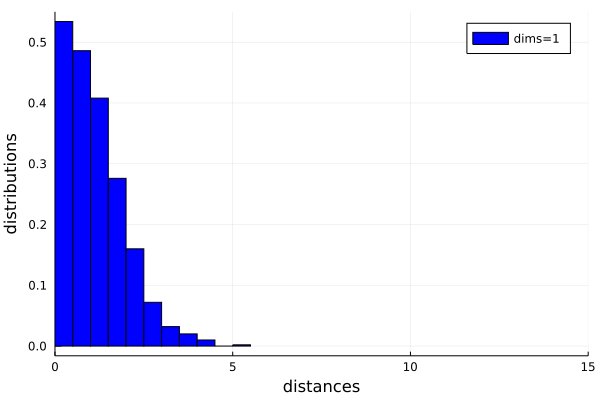
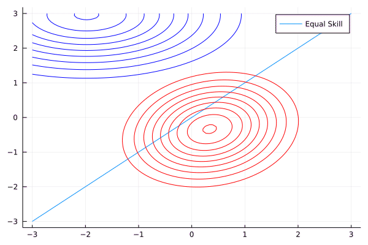
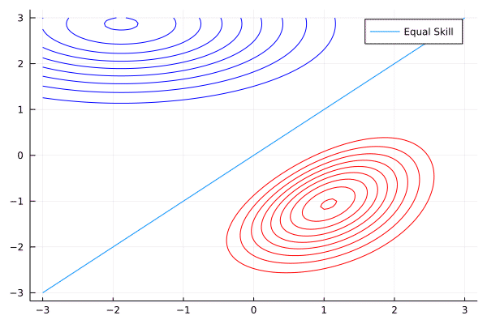
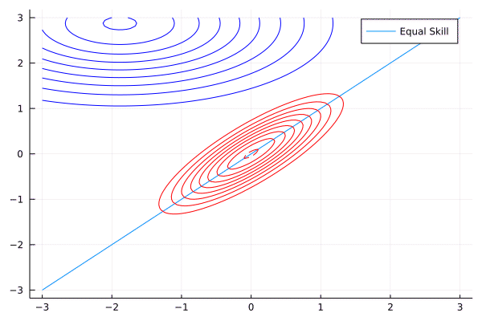
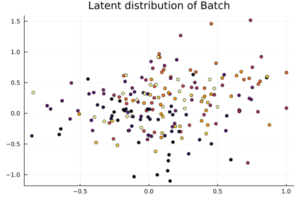
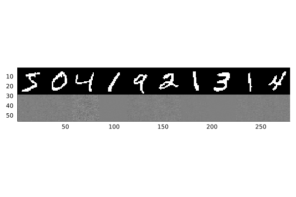

# Computer Science Communication

- Student Name: Brian Cheong

## Sharing

I am comfortable sharing my submission to:

- [x] Peers on Forum
- [x] Anonymously via Course Twitter: [@ProbablyLearn](https://twitter.com/ProbablyLearn)

## Summary
For the ComSci Communication assignment, I opted to create a few animations based on the plots created in the assignments. I hope that these animations give some good intuition about ideas covered in the course!

### List of animations

**1. Curse of dimensionality**

This gif demonstrates how the expected distance between samlpes increases with the dimensionality. This poses a problem for sampling, since the distribution becomes less dense as dimensionality increases. Sampling a unit interval of the distribution yields exponentially less information since the data is much more sparse. Another consequence of increasing dimensionality is that the largest contribution of mass begins to move away from the mean. Instead, the "Goldilocks Zone" of information rich regions lies some (often unknown) distance away from the origin.

**2. SVI with AD on toy chess data**

*Player 1 wins 1 game.*

*Player 1 wins 10 games.*

*Each Player wins 10 games.*

The above gifs demonstrate how stochastic variational inference is able to learn parameters $\phi$ for the approximate variational distribution $q_\phi$ and approximate the true model posterior for the given case. Each posterior is mapping every pair of player skills to the likelihood of the scenario. The red curves are the true posterior, while the moving blue curve is the approximate variational distribution of independent Gaussians. Note how the $q_\phi$ is able to roughly cover the same areas, even though it cannot properly mimic the tilt in the distribution.

**3. Latent distribution of batch over training**

This animation shows how the latent distribution of a batch of MNIST digit data changes over several epochs. I hoped to show the digits converging into clusters over time, but the convergence is not very noticeable and happens very quickly at the start of training. It's quite a long gif; you'll be able to tell when it jumps back to the start. Note how some of the different digits begin to separate out as training progresses.  Unfortunately, the model still has trouble distinguishing between numbers such as 4.7, and 9, as well as 3,5,6,8, so there is quite a large cluster of multiple digits in the top left region. A possible remedy would be to include convolutional layers for feature extraction ahead of the 500 fully connected neurons, since they capture the spatial relations between pixels efficiently.

**4. Visualizing model reconstruction**

The above gif demonstrates how the simple 500 neuron VAE reconstructs the binarized MNIST digits. Initially, all the reconstructions appear to be blobs of pixels, but as training progresses, the blobs begin to morph into their respective digits. The best reconstructed digits are 0, 1, and 9. Note how the 4s get reconstructed into 9s. This indicates that their orientation in the latent space z are likely similar to each other, which makes sense since 4 is already visually similar. One way to separate out these similar looking digits in the latent space z would be to construct a latent space with higher dimensionality to capture more complexity. 